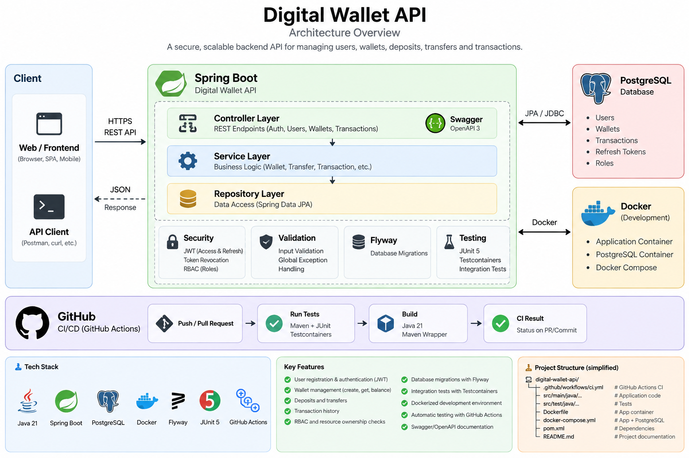

# Digital Wallet API

[](https://github.com/RazvanBogdan28/Digital-Wallet-API/actions/workflows/ci.yml)

A production-deployed backend REST API built with **Java 21** and **Spring Boot** for user authentication, wallet management, deposits, transfers and transaction history.

The project focuses on **layered architecture, security, transactional consistency, idempotency, concurrency handling and integration testing**.

A companion React frontend consumes this API — see [Frontend](#frontend) below.

## Live Demo

- **API:** https://digital-wallet-api-production-2f16.up.railway.app
- **Swagger UI:** https://digital-wallet-api-production-2f16.up.railway.app/swagger-ui/index.html
- **Web app:** https://digitalwalletfrontend.vercel.app
- **GitHub:** https://github.com/RazvanBogdan28/Digital-Wallet-API

## Features

- User registration
- JWT authentication
- Access and refresh tokens
- Refresh token persistence
- Logout and refresh-token revocation
- Role-based authorization with `USER` and `ADMIN` roles
- Wallet creation
- Multiple supported currencies (`EUR`, `USD`, `RON`)
- Deposits
- Wallet-to-wallet transfers
- Paginated transaction history
- Wallet ownership validation
- Idempotent transfers using `Idempotency-Key`
- Optimistic locking
- Request validation
- Global exception handling
- Database migrations with Flyway
- Swagger / OpenAPI documentation
- Docker and Docker Compose
- Unit and integration testing with Testcontainers
- GitHub Actions CI
- Railway deployment
- React frontend (see [Frontend](#frontend))

## Tech Stack

- Java 21
- Spring Boot 4.1
- Spring MVC
- Spring Data JPA / Hibernate
- Spring Security
- JWT
- PostgreSQL
- Flyway
- Maven
- Docker
- Docker Compose
- Testcontainers
- JUnit
- Mockito
- Swagger / OpenAPI
- GitHub Actions
- Railway

## Architecture



The application follows a layered architecture:

```text
Controller
    |
    v
Service
    |
    v
Repository
    |
    v
PostgreSQL
```

### Main packages

```text
controller
dto
entity
repository
service
security
exception
config
```

### Responsibilities

- **Controller** — handles HTTP requests and responses
- **Service** — contains business logic
- **Repository** — handles database access
- **DTO** — defines API request and response models
- **Entity** — represents persisted domain objects
- **Security** — JWT authentication and authorization
- **Exception** — centralized API error handling
- **Config** — application and OpenAPI configuration

## Domain Model

### User

Represents an application user.

A user can own multiple wallets, with the application enforcing one wallet per currency for a user.

### Wallet

Represents a wallet associated with a user and a currency.

Supported currencies:

- EUR
- USD
- RON

### Transaction

Represents financial operations such as deposits and transfers.

### Refresh Token

Stores refresh tokens used to generate new access tokens and supports token revocation during logout.

## Authentication

The application uses **stateless JWT-based authentication**.

### Login

```http
POST /api/auth/login
```

Example request:

```json
{
  "email": "user@example.com",
  "password": "password123"
}
```

Successful authentication returns:

```json
{
  "userId": 1,
  "email": "user@example.com",
  "accessToken": "...",
  "refreshToken": "..."
}
```

Protected endpoints require:

```http
Authorization: Bearer <access-token>
```

### Refresh Access Token

```http
POST /api/auth/refresh
```

### Logout

```http
POST /api/auth/logout
```

Logout revokes the supplied refresh token.

## Authorization

The application supports role-based authorization:

```text
USER
ADMIN
```

For example:

```http
GET /api/users
```

is restricted to users with the `ADMIN` role, enforced in the service layer so the check applies consistently regardless of how the request reaches the controller.

Wallet operations also enforce ownership rules so users cannot access or modify wallets belonging to other users.

## Wallet Endpoints

### Create Wallet

```http
POST /api/wallets
```

### Get Wallet

```http
GET /api/wallets/{id}
```

### Get User Wallets

```http
GET /api/wallets/user/{userId}
```

### Deposit

```http
POST /api/wallets/{id}/deposit
```

### Transfer

```http
POST /api/wallets/{id}/transfer
```

Transfers require an idempotency header:

```http
Idempotency-Key: unique-value
```

Reusing the same key prevents the same transfer from being processed more than once.

## Transaction History

```http
GET /api/transactions/wallet/{walletId}
```

Pagination parameters:

```text
page=0
size=10
```

Example:

```http
GET /api/transactions/wallet/1?page=0&size=10
```

## Error Handling

The API uses centralized exception handling and returns structured error responses.

Handled situations include:

- invalid credentials
- validation errors
- user not found
- wallet not found
- wallet already exists
- insufficient funds
- same-wallet transfer
- currency mismatch
- duplicate transaction
- concurrent modification
- unauthorized access
- forbidden wallet access

## Database Migrations

Flyway is used for schema migrations.

Migration files are located in:

```text
src/main/resources/db/migration
```

Flyway automatically applies migrations when the application starts.

## Optimistic Locking

Wallet balances use optimistic locking to reduce the risk of concurrent updates overwriting each other.

The wallet entity uses a version field managed by JPA.

Concurrent modification conflicts are handled by the API and returned as an HTTP conflict response.

## Idempotency

Transfers support idempotency through the:

```http
Idempotency-Key
```

header.

Reusing the same key prevents duplicate financial operations. This is especially important when clients retry requests because of network failures.

## Swagger / OpenAPI

Production Swagger UI:

```text
https://digital-wallet-api-production-2f16.up.railway.app/swagger-ui/index.html
```

Local Swagger UI:

```text
http://localhost:8080/swagger-ui/index.html
```

Local OpenAPI definition:

```text
http://localhost:8080/v3/api-docs
```

Swagger supports JWT authentication through the **Authorize** button.

## Frontend

A React + Vite single-page client for this API lives in a separate repository:

- **Repo:** https://github.com/RazvanBogdan28/Digital-Wallet-Frontend
- **Live app:** https://digitalwalletfrontend.vercel.app

It covers registration, sign in, wallet management, deposits, transfers and transaction history, with silent access-token refresh and UI states that reflect the API's ownership and role checks (e.g. a dedicated "no access" view on a `403`, rather than a generic error).

## Running with Docker

Create a `.env` file in the project root:

```env
DB_PASSWORD=your_database_password
JWT_SECRET=your_base64_jwt_secret
```

Then run:

```bash
docker compose up --build
```

Docker Compose starts:

- PostgreSQL
- Digital Wallet API

The application will be available at:

```text
http://localhost:8080
```

Swagger:

```text
http://localhost:8080/swagger-ui/index.html
```

Stop the containers with:

```bash
docker compose down
```

To also remove the PostgreSQL volume:

```bash
docker compose down -v
```

## Running Locally

### Requirements

- Java 21
- PostgreSQL
- Maven or Maven Wrapper

Configure these environment variables:

```text
DB_PASSWORD
JWT_SECRET
```

Optional:

```text
DB_URL
DB_USERNAME
```

Default database configuration:

```text
jdbc:postgresql://localhost:5432/digital_wallet
```

Run the application with:

```bash
./mvnw spring-boot:run
```

On Windows:

```powershell
.\mvnw.cmd spring-boot:run
```

## Tests

Run all tests with:

```bash
./mvnw clean test
```

On Windows:

```powershell
.\mvnw.cmd clean test
```

The project includes:

- unit tests
- service tests
- controller integration tests
- authentication tests
- authorization tests
- ownership tests
- PostgreSQL integration tests using Testcontainers

Testcontainers starts an isolated PostgreSQL container for integration testing.

## CI/CD and Deployment

GitHub Actions runs the Maven test suite on pushes and pull requests targeting `main`.

The application is deployed to **Railway** with PostgreSQL as the production database.

Production deployment is available through the links in the **Live Demo** section.

## Security Notes

Sensitive values such as database passwords and JWT secrets are provided through environment variables.

The `.env` file must not be committed to Git.

Example:

```text
.env
```

should be included in `.gitignore`.

Never commit production secrets, JWT signing keys or database credentials to the repository.

## Project Goals

This project demonstrates backend development concepts such as:

- REST API design
- layered architecture
- authentication and authorization
- relational database design
- transaction management
- concurrency handling
- idempotency
- exception handling
- automated testing
- containerization
- API documentation
- continuous integration
- cloud deployment

## Future Improvements

Possible future additions:

- refresh token rotation
- hashed refresh-token storage
- logout from all devices
- audit logging
- rate limiting
- Redis caching
- fraud / risk checks
- webhooks
- observability and metrics
