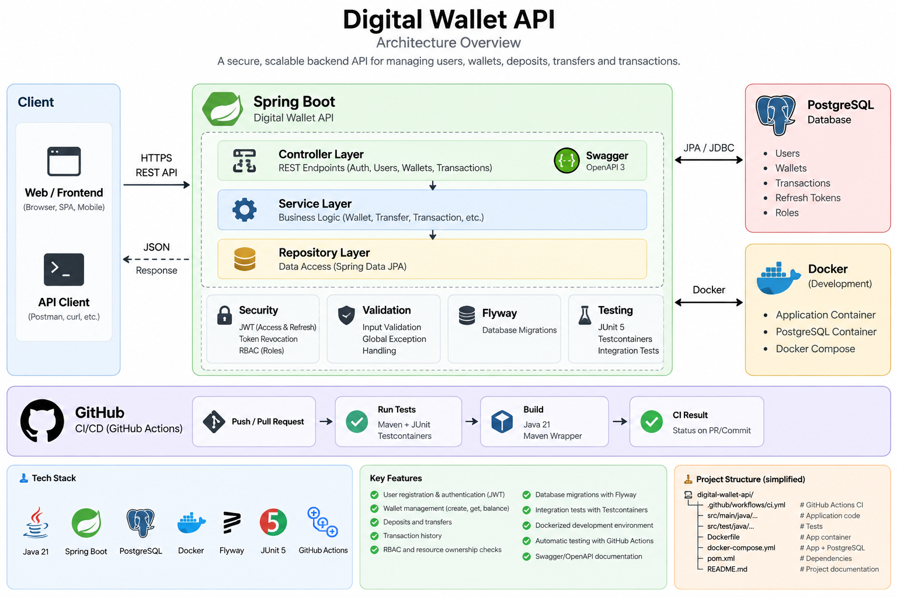

# Digital Wallet API

[](https://github.com/RazvanBogdan28/Digital-Wallet-API/actions/workflows/ci.yml)
[](LICENSE)

A production-deployed backend REST API built with **Java 21** and **Spring Boot** for user authentication, wallet management, deposits, transfers and transaction history.

The project focuses on **layered architecture, security, transactional consistency, idempotency, concurrency handling and integration testing**.

A companion React frontend consumes this API — see [Frontend](#frontend) below.

## Live Demo

- **API:** https://digital-wallet-api-production-2f16.up.railway.app
- **Swagger UI:** https://digital-wallet-api-production-2f16.up.railway.app/swagger-ui/index.html
- **Web app:** https://digitalwalletfrontend.vercel.app
- **GitHub:** https://github.com/RazvanBogdan28/Digital-Wallet-API

## Features

- User registration
- JWT authentication
- Access and refresh tokens
- Refresh token persistence
- Logout and refresh-token revocation
- Role-based authorization with `USER` and `ADMIN` roles
- Wallet creation
- Multiple supported currencies (`EUR`, `USD`, `RON`)
- Deposits
- Wallet-to-wallet transfers
- Paginated transaction history
- Wallet ownership validation
- Idempotent deposits and transfers using `Idempotency-Key`
- Consistent wallet balance and transaction snapshots
- Wallet row locking in a consistent order, with JPA versioning
- Request validation
- Global exception handling
- Database migrations with Flyway
- Swagger / OpenAPI documentation
- Docker and Docker Compose
- Unit and integration testing with Testcontainers
- GitHub Actions CI
- Railway deployment
- React frontend (see [Frontend](#frontend))

## Tech Stack

- Java 21
- Spring Boot 4.1
- Spring MVC
- Spring Data JPA / Hibernate
- Spring Security
- JWT
- PostgreSQL
- Flyway
- Maven
- Docker
- Docker Compose
- Testcontainers
- JUnit
- Mockito
- Swagger / OpenAPI
- GitHub Actions
- Railway

## Architecture



Controllers handle HTTP requests, services enforce business rules, and repositories persist data in PostgreSQL.

### Main packages

```text
controller
dto
entity
repository
service
security
exception
config
```

### Responsibilities

- **Controller** — handles HTTP requests and responses
- **Service** — contains business logic
- **Repository** — handles database access
- **DTO** — defines API request and response models
- **Entity** — represents persisted domain objects
- **Security** — JWT authentication and authorization
- **Exception** — centralized API error handling
- **Config** — application and OpenAPI configuration

## Domain Model

### User

Represents an application user.

A user can own multiple wallets, with the application enforcing one wallet per currency for a user.

### Wallet

Represents a wallet associated with a user and a currency.

Supported currencies:

- EUR
- USD
- RON

### Transaction

Represents financial operations such as deposits and transfers.

### Refresh Token

Stores refresh tokens used to generate new access tokens and supports token revocation during logout.

## Authentication

The application uses **stateless JWT-based authentication**.

### Register

Registration is handled by the users endpoint:

```http
POST /api/users
```

Example request:

```json
{
  "firstName": "Jane",
  "lastName": "Doe",
  "email": "user@example.com",
  "password": "password123"
}
```

Returns `201 Created` with the new user (`id`, `firstName`, `lastName`, `email`). Passwords are excluded from responses. New accounts get the `USER` role.

Email addresses are matched without case sensitivity and surrounding whitespace. New addresses are stored trimmed and lowercase; the database enforces uniqueness on normalized addresses.

### Login

```http
POST /api/auth/login
```

Example request:

```json
{
  "email": "user@example.com",
  "password": "password123"
}
```

Successful authentication returns:

```json
{
  "userId": 1,
  "email": "user@example.com",
  "accessToken": "...",
  "refreshToken": "..."
}
```

Protected endpoints require:

```http
Authorization: Bearer <access-token>
```

### Refresh Access Token

```http
POST /api/auth/refresh
```

Both refresh and logout accept this JSON body:

```json
{
  "refreshToken": "<refresh-token>"
}
```

Refresh returns `200 OK` with a new access token:

```json
{
  "accessToken": "<new-access-token>"
}
```

The stored refresh-token expiry is derived from the token's expiration claim, using the configured refresh lifetime.

### Logout

```http
POST /api/auth/logout
```

Logout returns `204 No Content` and revokes the supplied refresh token. An already issued access token remains valid until its expiration.

## Authorization

The application supports `USER` and `ADMIN` roles.

| Endpoint | Access |
| --- | --- |
| `POST /api/users` | Public registration |
| `POST /api/auth/login`, `/refresh`, `/logout` | Public routes; refresh/logout validate the supplied refresh token |
| `GET /api/users` | ADMIN |
| `GET /api/users/{id}` | Own profile or ADMIN |
| `GET /api/wallets/user/{userId}` | Own wallets or ADMIN |
| `GET /api/wallets/{id}` | Wallet owner |
| Wallet creation, deposits and transfers | Owner of the account or source wallet |
| Transaction history and snapshot endpoints | Wallet owner |

ADMIN access to another user's wallet list does not grant permission to deposit into or transfer from that user's wallet. A transfer recipient may belong to another user, but both wallets must use the same currency.

## Wallet Endpoints

### Create Wallet

```http
POST /api/wallets
```

Example creation body:

```json
{
  "userId": 1,
  "currency": "EUR"
}
```

Returns `201 Created`. A user can have only one wallet per supported currency.

### Get Wallet

```http
GET /api/wallets/{id}
```

### Get User Wallets

```http
GET /api/wallets/user/{userId}
```

### Deposit

```http
POST /api/wallets/{id}/deposit
```

Deposits require both authentication and an idempotency key:

```http
POST /api/wallets/1/deposit
Authorization: Bearer <access-token>
Idempotency-Key: 38e17f2b-743e-4484-9705-1eab9371453f
Content-Type: application/json
```

```json
{
  "amount": "100.00"
}
```

Returns `200 OK` with the updated wallet, including its balance as a decimal string.

### Transfer

```http
POST /api/wallets/{id}/transfer
```

Transfers also require an idempotency header:

```http
Idempotency-Key: unique-value
```

Reusing the same key prevents the same transfer from being processed more than once.

Example request:

```http
POST /api/wallets/1/transfer
Authorization: Bearer <access-token>
Idempotency-Key: 6f1c2b3e-8a4d-4e7f-9c21-0b5d3a7e9f10
Content-Type: application/json
```

```json
{
  "toWalletId": 2,
  "amount": "25.00",
  "description": "Dinner split"
}
```

Successful response (the updated source wallet):

```json
{
  "id": 1,
  "userId": 1,
  "currency": "EUR",
  "balance": "75.00"
}
```

## Transaction History

```http
GET /api/transactions/wallet/1?page=0&size=10
Authorization: Bearer <access-token>
```

`page` starts at `0`. `size` defaults to `10` and must be between `1` and `100`.

Transactions are ordered by `createdAt DESC, id DESC`, including a deterministic tie-breaker for matching timestamps. The response contains `content`, `totalElements`, `totalPages` and the Spring Data pagination metadata.

Example transaction in `content`:

```json
{
  "id": 2,
  "fromWalletId": 1,
  "toWalletId": 2,
  "amount": "25.00",
  "currency": "EUR",
  "type": "TRANSFER",
  "status": "COMPLETED",
  "createdAt": "2026-10-02T18:30:00Z",
  "description": "Dinner split"
}
```

Separate pagination requests read the current history. New transactions can shift page boundaries between requests; pagination does not freeze the history across an entire browsing session.

### Wallet and recent transactions snapshot

```http
GET /api/transactions/wallet/1/window?size=100
Authorization: Bearer <access-token>
```

`size` defaults to `100` and must be between `1` and `100`.

```json
{
  "wallet": {
    "id": 1,
    "userId": 1,
    "currency": "EUR",
    "balance": "75.00"
  },
  "items": [
    {
      "id": 2,
      "fromWalletId": 1,
      "toWalletId": 2,
      "amount": "25.00",
      "currency": "EUR",
      "type": "TRANSFER",
      "status": "COMPLETED",
      "createdAt": "2026-10-02T18:30:00Z",
      "description": "Dinner split"
    },
    {
      "id": 1,
      "fromWalletId": 1,
      "toWalletId": 1,
      "amount": "100.00",
      "currency": "EUR",
      "type": "DEPOSIT",
      "status": "COMPLETED",
      "createdAt": "2026-10-02T18:00:00Z",
      "description": null
    }
  ],
  "totalElements": 2,
  "complete": true,
  "snapshotAt": "2026-10-02T18:35:00Z"
}
```

The wallet, recent transactions and count are read within one PostgreSQL `REPEATABLE_READ` transaction. This prevents the chart from combining a balance and transaction window from different database states.

`items` contains the newest transactions in the same order as history. `complete` is true when all transactions fit in the returned window. With an incomplete window, the balance before its oldest transaction may be nonzero.

`snapshotAt` is the UTC application timestamp recorded when the read begins; it is not a reusable database snapshot identifier. Transaction `createdAt` timestamps also include a UTC offset (`Z`), allowing clients to display local time correctly.

## Error Handling

Business and validation exceptions use centralized handling and structured error responses. Security-filter and framework-generated errors may use a different response body; clients should also inspect the HTTP status.

Handled situations include:

- invalid credentials
- validation errors
- user not found
- wallet not found
- wallet already exists
- insufficient funds
- same-wallet transfer
- currency mismatch
- duplicate transaction
- concurrent modification
- database integrity conflicts
- missing or invalid idempotency keys
- unauthorized access
- forbidden wallet access

Example (`400 Bad Request` on a transfer larger than the balance):

```json
{
  "error": "INSUFFICIENT_FUNDS",
  "message": "Insufficient funds in wallet with id: 1",
  "timestamp": "2026-09-20T19:20:47.657821911",
  "status": 400
}
```

## Database Migrations

Flyway is used for schema migrations.

Migration files are located in:

```text
src/main/resources/db/migration
```

Flyway automatically applies migrations when the application starts.

## Money Handling

Monetary values use Java `BigDecimal` and PostgreSQL `NUMERIC(19, 2)`.

**Response `amount` and `balance` fields are decimal strings**, such as `"25.00"`, rather than JSON numbers. Clients should preserve these strings and use decimal arithmetic or integer cents for calculations, instead of converting money to floating-point numbers.

Requests accept decimal strings or JSON numbers. Decimal strings are recommended when the client must preserve the exact amount. Amounts must be positive, have at most two decimal places, and fit the database range: `0.01` to `99999999999999999.99`. Resulting wallet balances must also fit the database range.

Transfers require matching currencies. No currency conversion is performed.

## Concurrency and Transactions

Deposits and transfers execute inside database transactions so balance updates and the transaction record commit or roll back together.

Money operations lock wallet rows before changing balances. Transfers acquire locks in ascending wallet ID order, including transfers in opposite directions. Deposits use the same wallet row-locking mechanism. This avoids opposite lock ordering for these operations.

Wallets also retain a JPA `@Version` field. Concurrent modification and integrity conflicts are reported through the API. Clients should handle conflicts and retry ambiguous operations using the original idempotency key.

## Idempotency

**Both deposits and transfers require `Idempotency-Key`.** The key must be nonblank and no longer than 255 characters. Keys are unique across transactions, including deposits, transfers and different wallets.

Generate a fresh UUID for each **new logical operation**. If its response is lost or its outcome is unknown, reuse the same key, endpoint and request values. Do not generate a new key just because the first request timed out or returned a server error.

| Situation | Response and client action |
| --- | --- |
| New valid operation | `200 OK` with the updated wallet |
| Completed operation retried with the same key and matching values | `409 DUPLICATE_TRANSACTION`; no new operation is performed. Refresh the wallet and history. |
| Same key reused with different operation values | `400 INVALID_PARAMETER`; do not reuse the key for another operation. |
| Missing, blank or oversized key | `400 Bad Request`; correct the header. |
| Concurrent key uniqueness conflict | May return `409 DATA_INTEGRITY_CONFLICT`. This does not itself confirm completion; retry the identical operation with its original key to determine the outcome. |
| Lost connection, timeout or server error | Treat the outcome as unknown and retry with the original key and request. |

A duplicate retry returns a conflict, not a replay of the original success response. Normal authentication and ownership checks still apply.

The frontend retains unresolved operation details and keys in `sessionStorage` for the current tab, allowing the same operation to be retried after a page reload. Closing the dialog does not cancel a request already sent. Closing the tab can discard this recovery state.

## Swagger / OpenAPI

Production Swagger UI:

```text
https://digital-wallet-api-production-2f16.up.railway.app/swagger-ui/index.html
```

Local Swagger UI:

```text
http://localhost:8080/swagger-ui/index.html
```

Local OpenAPI definition:

```text
http://localhost:8080/v3/api-docs
```

Swagger uses a relative server URL, so local Swagger sends requests to the local application and deployed Swagger sends requests to its own host.

Swagger supports JWT authentication through the **Authorize** button. The local application must be running before its Swagger URL can be opened.

## Frontend

A React + Vite single-page client for this API lives in a separate repository:

- **Repo:** https://github.com/RazvanBogdan28/Digital-Wallet-Frontend
- **Live app:** https://digitalwalletfrontend.vercel.app

It covers registration, sign in, wallet management, deposits, transfers and transaction history. It uses a shared access-token refresh request, preserves the session after transient refresh failures, and offers retries for failed data loads. The balance chart uses the wallet snapshot endpoint and exact decimal strings for displayed amounts.

## Running with Docker

Create a `.env` file in the project root:

```env
DB_PASSWORD=your_database_password
JWT_SECRET=your_base64_jwt_secret
```

Then run:

```bash
docker compose up --build
```

Docker Compose starts:

- PostgreSQL
- Digital Wallet API

The application will be available at:

```text
http://localhost:8080
```

Swagger:

```text
http://localhost:8080/swagger-ui/index.html
```

Stop the containers with:

```bash
docker compose down
```

To also remove the PostgreSQL volume **and its stored database data**:

```bash
docker compose down -v
```

## Running Locally

### Requirements

- Java 21
- PostgreSQL
- Maven or Maven Wrapper

Configure these environment variables:

```text
DB_PASSWORD
JWT_SECRET
```

Optional:

```text
DB_URL
DB_USERNAME
```

Default database configuration:

```text
jdbc:postgresql://localhost:5432/digital_wallet
```

Set the variables in the shell or IDE run configuration. A `.env` file is read by Docker Compose; it is not automatically loaded by `spring-boot:run`.

Run the application with:

```bash
./mvnw spring-boot:run
```

On Windows:

```powershell
.\mvnw.cmd spring-boot:run
```

## Tests

Run all tests with:

```bash
./mvnw clean test
```

On Windows:

```powershell
.\mvnw.cmd clean test
```

The project includes:

- unit tests
- service tests
- controller integration tests
- authentication tests
- authorization tests
- ownership tests
- idempotency and request validation tests
- simultaneous money-operation tests
- stable history ordering and consistent wallet snapshot tests
- PostgreSQL integration tests using Testcontainers

Testcontainers starts an isolated PostgreSQL container for integration testing. Docker must be running before starting the integration tests.

## CI/CD and Deployment

GitHub Actions runs the Maven test suite on pushes and pull requests targeting `main`.

The application is deployed to **Railway** with PostgreSQL as the production database.

Production deployment is available through the links in the **Live Demo** section.

## Security Notes

Sensitive values such as database passwords and JWT secrets are provided through environment variables.

The `.env` file must not be committed to Git.

Example:

```text
.env
```

should be included in `.gitignore`.

Never commit production secrets, JWT signing keys or database credentials to the repository.

## Project Goals

This project demonstrates backend development concepts such as:

- REST API design
- layered architecture
- authentication and authorization
- relational database design
- transaction management
- concurrency handling
- idempotency
- exception handling
- automated testing
- containerization
- API documentation
- continuous integration
- cloud deployment

## Future Improvements

Possible future additions:

- refresh token rotation
- hashed refresh-token storage
- logout from all devices
- audit logging
- rate limiting
- Redis caching
- fraud / risk checks
- webhooks
- observability and metrics

## License

This project is licensed under the MIT License. See the [LICENSE](LICENSE) file for details.
